# FuelBot: Fuel Tracking System

With the rising cost of living, and the need to be able to easily manage one's budget, FuelBot is a simple tracking system to help vehicle users understand how much they are spending on fuel. This useful little tool can quickly analyse your average spend so that you can better manage your finances.

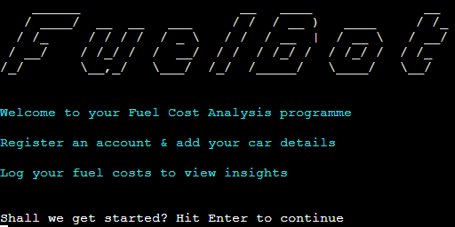

[Visit the FuelBot live app here](https://fuelbot.herokuapp.com/)

### Dummy Account:

For the purposes of project assessment a dummy account with the below details has been set up and the details of a car have been added. This means records and insights can be viewed fully without the need to complete a number of entries:

Username: joebloggs

Password: password1

 

## Contents
----

### [User Experience (UX)](#user-experience-ux-1)
- [Purpose](#purpose)
- [User Stories](#user-stories)

### [Design](#design-1)
- [Colour Scheme](#colour-scheme)
- [Programme Model](#programme-model)

### [Features](#features-1)
- [Existing Features](#existing-features)
- [Future Features](#future-features)

### [Technologies](#technologies-1)
- [Languages Used](#languages-used)
- [External Modules](#external-modules)

### [Version Control](#version-control-1)

### [Deployment](#deployment-1)

### [Testing](#testing-1)
- [Pep8](#pep_8)
- [User Story Testing](#user-story-testing)
- [Bugs](#bugs)

### [Credits](#credits-1)
- [Resources](#resources)
- [Acknowledgements](#acknowledgements)

 

----

 

## User Experience (UX)
### **Purpose**

Aimed at people who want to better understand how much they are spending on their vehicles so they can be better informed when making financial decisions. 

FuelBot allows the user to log details for up to 3 vehicles. They can regularly track their fuel spend and any additional costs on general vehicle expenses.
Once they have completed a minimum of 3 entries this handy programme will be able to offer insights about their average spend per month/week/day as well as average cost per litre and mpg.

 

### User Stories

Users:
 - People wanting to cut their spending down and save
 - Motor enthusiasts who like to track their vehicles efficiency

 Goals:
  - I want to see my average spend on fuel per month/week/day
  - I want to be able to add multiple vehicles
  - I want to know my vehicles mpg
  - I want to be able to see my past records

 

----

## Design
### **Colour Scheme**
Coloured fonts were used to make the programme more visually appealing. The primary colour was used for core text, while the secondary colour was used mostly to inidicate a system message to the user.

Primary colour: Light cyan

Secondary colour: Yellow

 

### **Typography**
For each core screen the heading is presented in a chunky font. This has been created using [pyfiglet](https://pypi.org/project/pyfiglet/0.7/) font "slant".
The font has a motorsport feel to it and so is in keeping with a tool based around vehicle performance.

 

### **Programme Model**

The below [Lucid](https://www.lucidchart.com/pages/) flowchart was created when thinking about the structure of this programme. A clear vision of the process helped to design a core model.

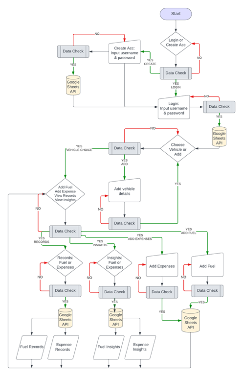

 

----

## Features
### **Existing Features**

Welcome Page

This is the entry point to the programme. It provides to the user the programme name, logo and core function information.

 

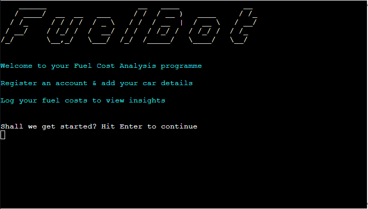

Login Menu

This first menu allows the user to login if they already have an account, to create an account or to view an 'About' page.

 

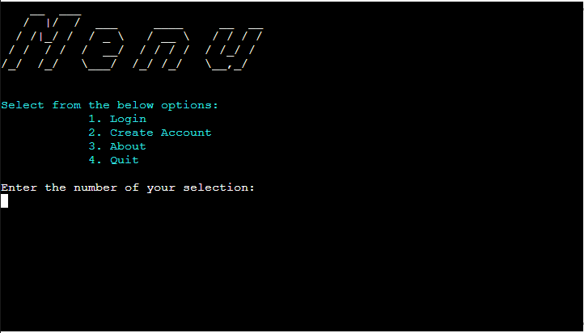

About

This is a straight forward information page about how FuelBot works. There is no interactivity for the user except to hit the return button when they are finished reading.

 

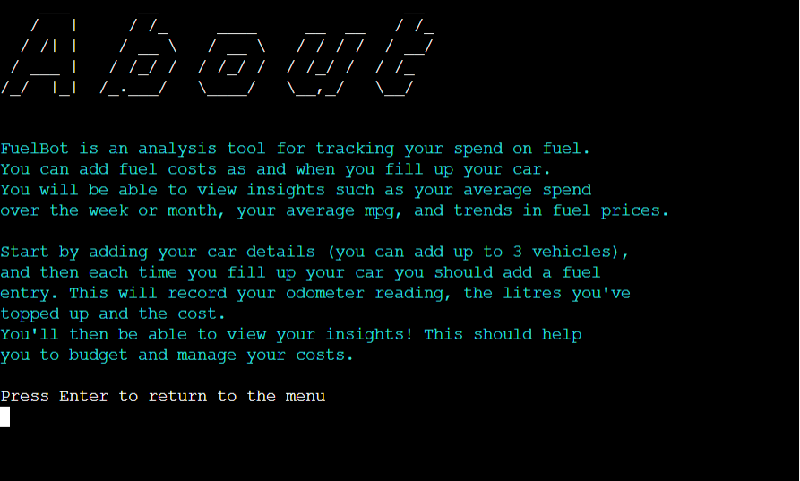

Create Account

The sign page allows the user to create an account by setting a unique username and choosing a password. These details are saved to a google worksheet.

 

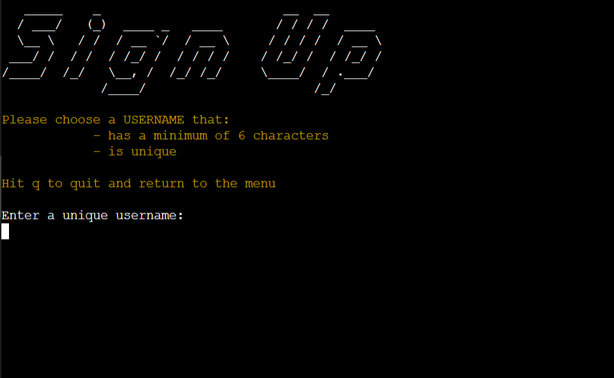

Login

The below screenshot shows the login details for a dummy account.

 

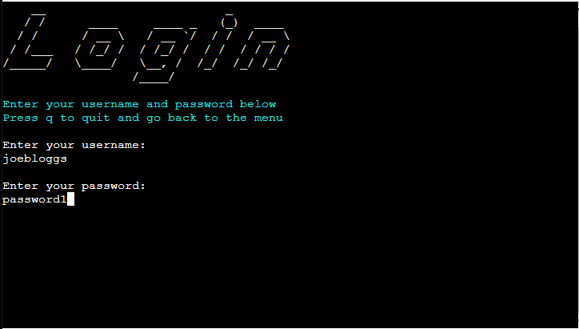

Vehicles Choice Page

This is the first page that is displayed to the user after they have successfully logged in. It lists any already saved vehicles. If the user wants to add a new vehicle they simply select an empty slot as instructed.

 

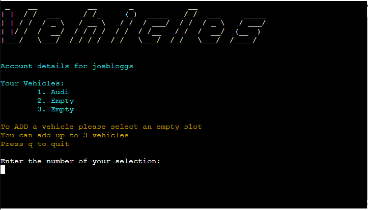

Add Vehicle

The below screenshot shows an example vehicle being added

 

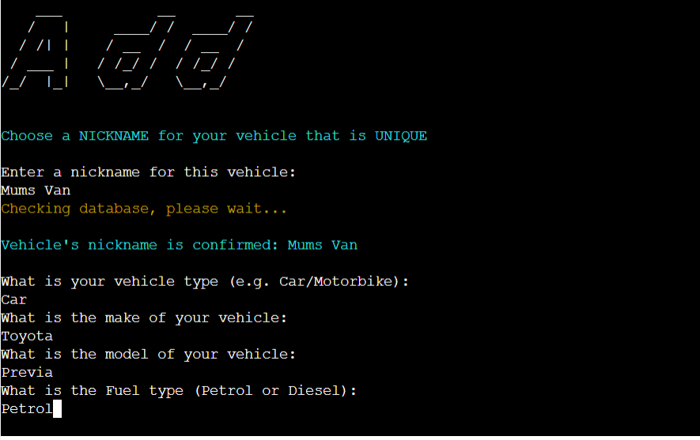

Vehicle Account Menu

The vehicle account menu provides access to the main features of FuelBot. Here the user can select to add a fuel entry, add expenses, view previous records, or view insights.

 

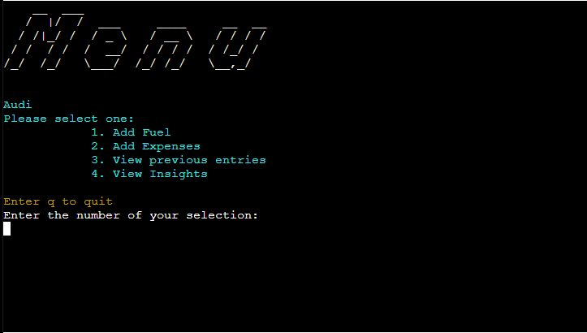

Add Fuel

The below screenshot shows an example fuel entry being completed

 

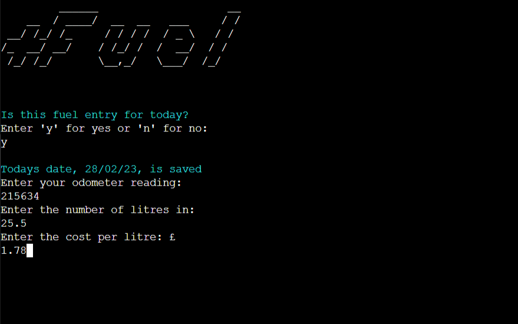

Add Expenses

The below screenshot shows an example expense being entered

 

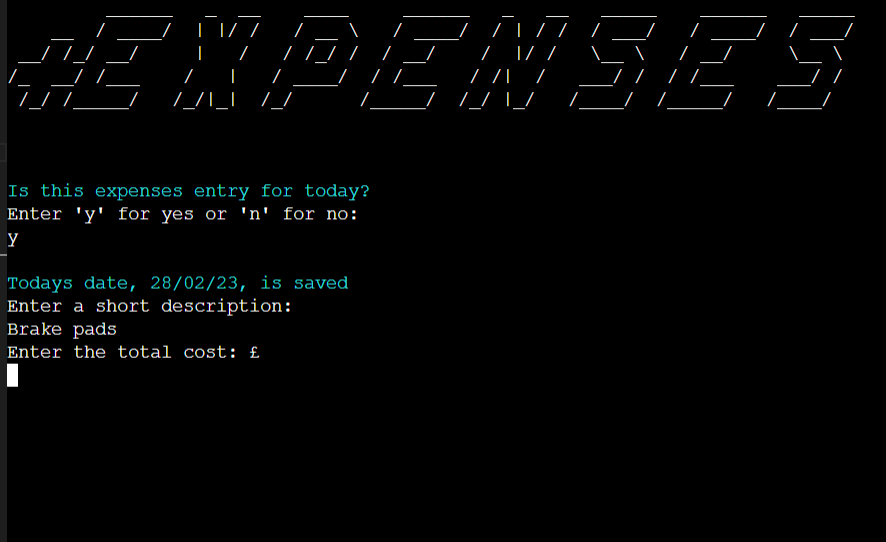

Previous Records

The user will be shown a menu where they can select if they want to view records for fuel or expenses. They will then be taken to a new screen that displays all their previous records for that specific vehicle.

 

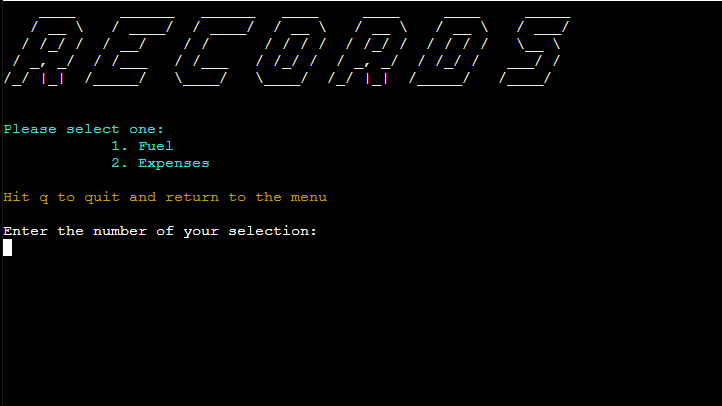

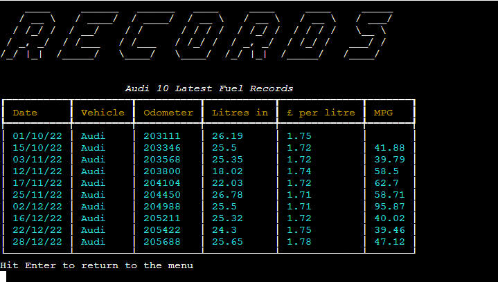

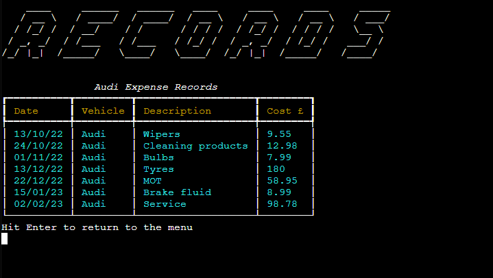

Insights

The user will be shown a menu where they can select if they want to view insights for fuel or expenses. They will then be taken to a new screen that displays these insights for that specific vehicle.

 

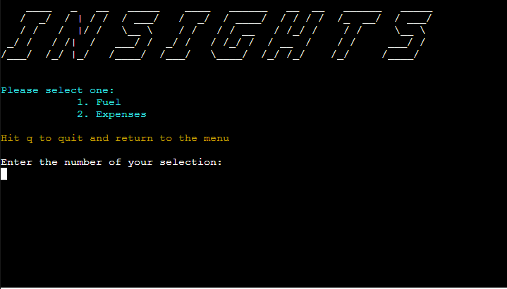

 

Fuel insights show averages for mpg, cost per litre, cost per month, week and day, and miles per month, week and day:

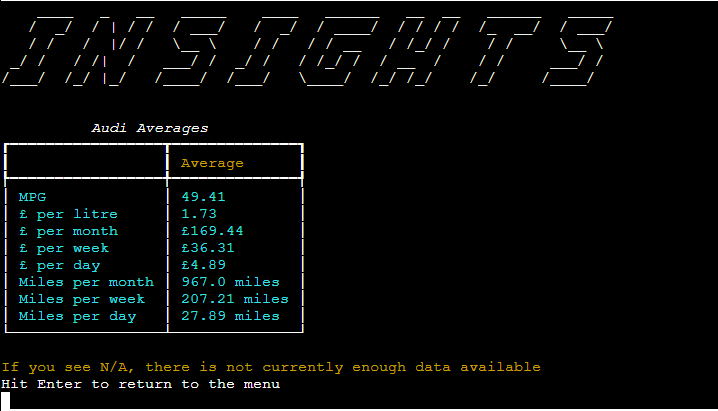

 

Expense insights show averages for cost per month, week and day:

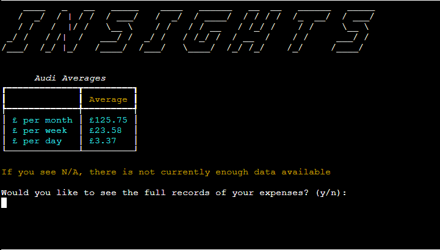

 

### **Future Features**

There is certainly further functionality I would have liked to add to this tool given time. This includes:
 - Use of graphs via matplotlib or pandas would really enhance the visual expenerience for the user. For example it would be great to plot the change in fuel price over a period of time.
 - I would like to add the functionality to delete entries and to edit or remove vehicles attached to a persons account.

 

----

## Technologies
### **Languages Used**
FuelBot is written in Python

 

**External Modules**

[rich.table](https://rich.readthedocs.io/en/stable/tables.html) : used to create data tables

[os](https://docs.python.org/3/library/os.html) : used in function to clear the terminal

[time](https://docs.python.org/3/library/time.html) : used to create a delay function

[re](https://docs.python.org/3/library/re.html) : re.match used to check the date pattern is correct

[statistics](https://docs.python.org/3/library/statistics.html) : the mean function from statistics was used to calculate averages

[datetime](https://docs.python.org/3/library/datetime.html) : used in date calculations and also to get the entry date from the user

[pyfiglet](https://pypi.org/project/pyfiglet/0.7/) : figlet was used to create the logo

[termcolor](https://pypi.org/project/termcolor/) : colored from terncolor was used to add colour to fonts

[dateutil](https://pypi.org/project/python-dateutil/) : relativedelta from dateutil was used to calculate the number of months between two dates

[gspread](https://docs.gspread.org/en/latest/) : used to access and update google worksheets

[google.oauth2.service_account](https://google-auth.readthedocs.io/en/master/reference/google.oauth2.service_account.html) : needed as part of the google drive api

 

----

## Version Control
Version control has been maintained using Git. The code written for this website has been updated via regular commits to GitHub.

 

----

## Deployment
This project was built using a [Code Institute template](https://github.com/Code-Institute-Org/python-essentials-template) on [Github](https://github.com/), and has been deployed on [Heroku](https://www.heroku.com/)

## Heroku
## How to deploy
1. Log in to Heroku account
2. Click on button to 'Create new app'
3. Enter a name for your app (this must be unique)
4. Select the relevant region, and click 'Create app'
5. On the main app page, select the 'Settings' tab
6. Click on the 'Reveal Config Vars' button
7. Using uppercase letters add 'PORT' to the key box, and '8000' to the value box
8. Click 'Add'
9. Using uppercase letters again add 'CREDS' to the key box
10. From the workspace copy details from the creds.json file and paste them into the value box
11. Click 'Add'
12. Click 'Add Buildpack'
13. Select Python and click 'Save changes'
14. Select Node.js and click 'Save changes'
15. Ensure Python appears above Node.js
16. Go to the 'Deploy' tab 
17. Select the GitHub button to connect to GitHub
18. Search for the Repository name and click 'Connect'
19. If wanted, click to 'Enable Automatic Deploys'
20. Click 'Deploy Branch' (if you do not enable automatic deployments you will need to manually deploy each time a change is pushed to the repo)
21. Click 'Open app' to view the live app

 

## GitHub
## How to Fork
1. Log in to Github account
2. Navigate to the project repository [here](https://github.com/llewellynksj/kitchen-catastrophe)
3. Click on the 'Fork' button in the top right corner of the page

## How to Clone
1. Log in to Github account
2. Navigate to the project repository [here](https://github.com/llewellynksj/kitchen-catastrophe)
3. Click on the green 'Code' button which will open a drop down menu
4. Copy the clone link you require (e.g. HTTPS/SSH)
5. In your code editor change the working directory to the location where you want the clone
6. Type 'git clone' and paste in the link

 

----

## Testing

### Dummy Account:

For the purposes of project assessment a dummy account with the below details has been set up and the details of a car have been added. This means records and insights can be viewed fully without the need to complete a number of entries:

Username: joebloggs

Password: password1

### **Pep 8**
The Pep8 Linter shows no errors in the final code of this programme. It does however show 4 warning messages. These messages all realte to my use of global variables.

From what I understood from online resources (such as [this article from Programiz](https://www.programiz.com/python-programming/global-keyword) and [this article from GeeksforGeeks](https://www.geeksforgeeks.org/global-local-variables-python/)) you can declare a global variable outside of functions, and if you are re-assigning it’s value within a function you need to use the global keyword to do this.
Linter wants me to change these variables to uppercase as it thinks they are constants but they are not constants as their value changes.
Given more time I would have liked to explore this issue further as it appears this is not the pythonic way to do this. It is something I intend to fix in the future.

 

### **User Story Testing**

| User Story | Solution | Tested & Successfully Completed |
| :----| :---| :----------------------:|
| I want to see my average spend on fuel per month/week/day  | Fuel insights provides averages per month, week and day | Yes |
| I want to be able to add multiple vehicles  | The first page after logging in displays any currently saved vehicles and allows the user to add up to a maximum of 3 vehicles all together | Yes |
| I want to know my vehicles mpg | Mpg is calculated automatically when a fuel entry is put through the 'Add Fuel' feature. The user must have a minimum of 3 fuel entries to view the mpg on the insights page | Yes |
| I want to be able to see my past records | The previous records options allows the user to view any previous fuel and expense entries related to a specific vehicle | Yes |

 

### **Bugs**
  
  | Raised by | Bug | Solution |
  | :---      | :---| :---     |
  | User tester | Username not being found when logging in straight after account creation | Moved relative variable to within the correct function so that it was being called and the correct time |
  | User tester | Average cost per litre and average cost per week and day not returning as float | Used the round() method to ensure the result of the calculation is rounded to 2 decimal places |
  | User tester | Error when trying to calculate fuel stats as not enough data | Add a requirement for the list of entries to be 3 or more otherwise prints error |
  | Pep8 Linter | Error (‘catching classes that do not inherit from baseexception is not allowed’) when using a try/except statement to handle a ZeroDivisionError for the insights calculations | Attempted to use Exception and BaseException however these did not resolve the issue and I understand it is not best practice. Used a different piece of code to circumvent needing this but it is something I hope to investigate more thoroughly in the future |
  | Heroku deployment | Getting an error as not able to find rich.table module or dateutil module | rich and dateutil not appearing in requirements.txt file so manually added these |
 
 

----

## Credits
### **Resources**

[Khuyen Tran, published in Towards Data Science](https://bit.ly/3kxoSlZ) : 'Prettify your Terminal Text with Termcolor and Pyfiglet'

[Rich](https://rich.readthedocs.io/en/stable/tables.html#table-options) : Module documentation for using rich.table

[Pep8 Style Guide](https://peps.python.org/pep-0008/#introduction) : Used for general guidance throughout

[Stack Overflow](https://bit.ly/41wBmuK) : 'Clear terminal in Python' Question and answers

[gspread](https://bit.ly/3mbUXAi) : Module documentation for using g.spread

[GeeksforGeeks](https://bit.ly/3IFH1WG) : 'Password validation in Python'

[GeeksforGeeks](https://bit.ly/3EJIgmQ) : 'Python - Find dictionary matching value in list'

[Code Academy](https://bit.ly/3J2Joog): Python Dictionaries Cheatsheet

[datetime](https://bit.ly/2NOUZLC) : Module documentation for using datetime

[Austin Cepalia, Real Python](https://bit.ly/3KLYbF6) : 'Intro to Object-Oriented Programming (OOP) in Python'

[GeeksforGeeks](https://bit.ly/3KRKVyq) : 'Global and Local Variables in Python'

[Digital Ocean](https://do.co/3Zq8Ol0) : '5 Ways to Find the Average of a List in Python'

[Care4Air](https://bit.ly/3EJqEY1) : 'How to Calculate your Fuel Consumption'

[Finxter](https://bit.ly/3Ycovem) : 'How to Filter a List of Lists in Python?'

[Sourav Dutta, published on Code Speedy](https://bit.ly/3ZdBWft) : 'How to find the number of weeks between two dates in Python?'

[Digital Ocean](https://do.co/41zP2oK) : 'How to Convert a String to a datetime or time Object in Python'

[Adam Smith](https://bit.ly/3IZQHN8) : 'How to check if a string matches a pattern in Python'

[Dan Bader, Real Python](https://bit.ly/3IF0h6Y): 'How and When to use _ _str_ _'

[Programiz](https://bit.ly/3YnEsid) : 'Python Global Keyword'

[Stack Overflow](https://bit.ly/3SQEC0p) : 'Proper indentation for multiline strings?' Question and answers

 

### Acknowledgements
Without the following people this project would not have been possible:
 - James Llewellyn: For his patience and for giving up all of his free time to be dad 24/7 so that I could code
 - My mentor Ronan: For telling me I shouldn't be so hard on myself and for always guiding me to the absolute best online resources
 - Lewys Brace: For all his brainy advice and help
 - The Code Institute Slack Community

